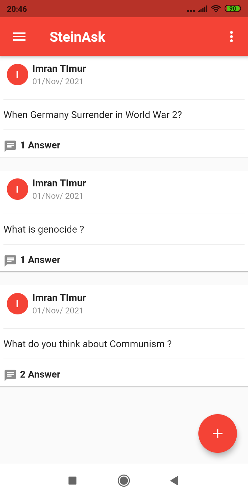
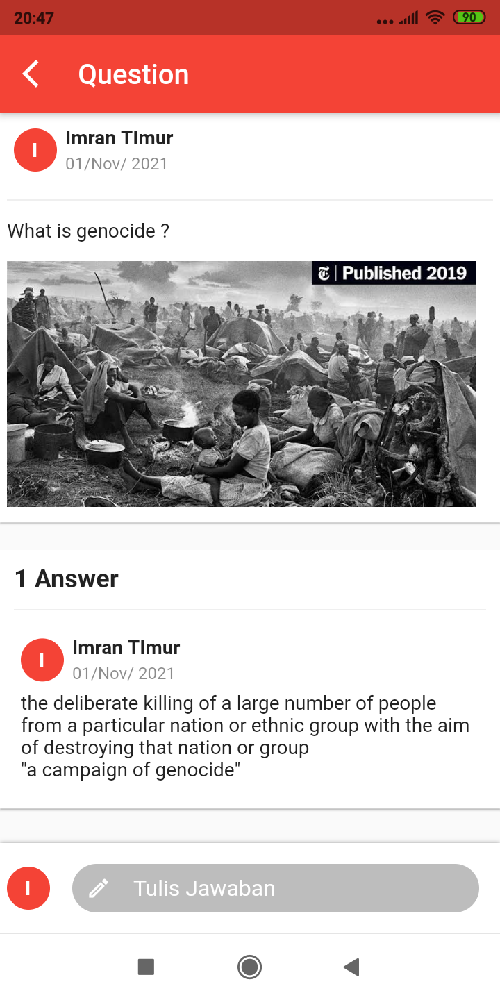
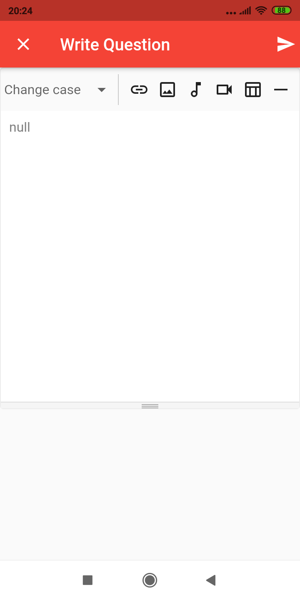

# Forum APP

Application using Socket.io and WYSWIG HTML

## API

You can edit the API address and Image Address at  lib/helper/server.dart and get Database and Backend API at https://github.com/mrstein21/forum_node_socket

## Screen Shoot

 
 
 

